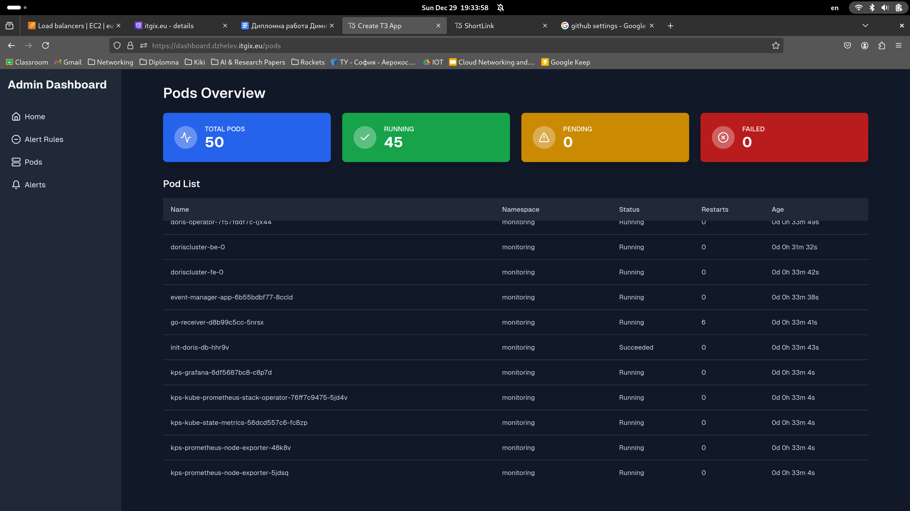

# Diploma Thesis: Advanced Monitoring and Alert Management in Kubernetes

## Project Overview
This project, developed as part of my Diploma Thesis for graduating 12th grade at TUES, showcases a robust monitoring and alerting system integrated into a Kubernetes environment. The primary objective was to create a demo application capable of generating and exporting metrics, deploying it within a production-grade AWS EKS cluster, and implementing advanced monitoring and visualization features. Additionally, the project demonstrates the use of modern technologies for alert management, business analysis, and resource management.

## Features

### 1. **Demo Application**
- A custom application designed to generate and export metrics in real-time.
- Metrics are exposed in a Prometheus-compatible format, making them ready for scraping and monitoring.

### 2. **Infrastructure Management with Terraform**
- The entire infrastructure is defined and provisioned using Terraform.
- AWS EKS cluster is set up to host the application and monitoring components.
- Kubernetes resources such as Deployments, Services, and ConfigMaps are managed declaratively.

### 3. **Monitoring with Prometheus and Grafana**
- **Prometheus** is integrated to scrape metrics from the demo application and Kubernetes resources.
- **Grafana** is used for advanced data visualization and monitoring dashboards.
- Grafana dashboards can be accessed at: [Grafana Dashboard](http://grafana.dzhelev.itgix.eu)

### 4. **Prometheus Alertmanager and Custom Golang Agent**
- **Prometheus Alertmanager** is configured to generate alerts based on predefined rules.
- A custom **Golang Agent** is implemented to:
  - Authenticate within the Kubernetes cluster.
  - Retrieve, create, modify, and delete Kubernetes resources (including alert rules).
  - Forward alerts to external systems for further processing.

### 5. **Business Analysis with Apache Doris**
- Alerts generated by Prometheus are forwarded to an **Apache Doris** data warehouse.
- Collected alert data can be analyzed for business insights and trends.

### 6. **Admin Dashboard for Resource Management**
- A dedicated admin dashboard is developed to manage Kubernetes resources.
- Users can interact with the cluster to modify alert rules and manage application configurations.
- The dashboard is accessible at: [Admin Dashboard](http://dashboard.dzhelev.itgix.eu)

### 7. **Shortlink Integration**
- A custom shortlink domain is configured to simplify access to project resources.
- Shortlinks are available via: [Shortlink Domain](http://shortlink.dzhelev.itgix.eu)

## Technologies Used
- **Infrastructure as Code (IaC)**: Terraform
- **Cloud Provider**: AWS (EKS, S3, Route 53, IAM)
- **Monitoring**: Prometheus, Prometheus Alertmanager
- **Data Visualization**: Grafana
- **Data Warehouse**: Apache Doris
- **Programming Language**: Golang
- **Container Orchestration**: Kubernetes

## Deployment Architecture
1. **AWS EKS Cluster**: Hosts the demo application, monitoring tools, and the Golang agent.
2. **Prometheus and Alertmanager**: Monitor metrics and trigger alerts.
3. **Grafana**: Visualizes metrics and logs.
4. **Golang Agent**: Processes alerts and manages Kubernetes resources.
5. **Apache Doris**: Stores alert data for business analysis.
6. **Custom Dashboard**: Admin UI for managing cluster resources and alert rules.

### Accessing Components (May be down, because the infrastructure is not always running)
- **Grafana**: [Grafana Dashboard](http://grafana.dzhelev.itgix.eu)
- **Admin Dashboard**: [Admin Dashboard](http://dashboard.dzhelev.itgix.eu)
- **Shortlink Domain**: [Shortlink](http://shortlink.dzhelev.itgix.eu)

## Screenshots
- **Shorlink (Demo App):**
  
  
  

- **Grafana Dashboard:**
  

- **Admin Dashboard:**
  
  
  
  
  

